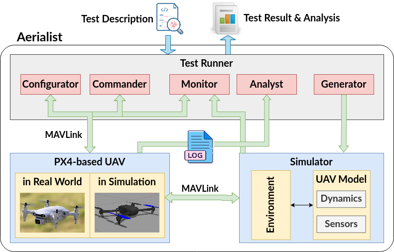

# Software Architecture

Below figure demonstrates the overall architecture of Aerialist and it is described in mored details in the [later sections](#software-architecture).
The implementation currently supports [PX4-Autopilot](https://github.com/PX4/PX4-Autopilot), but can be extended to support other UAV platforms as well.

To evaluate a test definition, we generate and execute the corresponding simulated test case automatically. The test case automates all necessary steps: setting up the test environment, building/running the firmware code, running/configuring the simulator with the simulated world properties, connecting the simulated UAV to the firmware, and applying the UAV configurations from the test case properties at startup.
Then, the test case commands are scheduled and sent to the UAV, the flight is monitored for any issues, and after test completion, the flight log file is extracted.

## Test Description

The de-facto testing standard of UAVs relies on manually-written system-level tests to test UAVs in the field. These tests are defined as specific software configurations (using parameters, config files, etc.), in a specific environment setup (e.g., obstacles placement, lightning conditions), and a set of runtime commands. Such runtime commands received during the UAV flight (from RC, GCS, onboard computers, etc.), make the UAV fly with a specific human observable behavior (e.g., flight trajectory, speed, distance to obstacles). We model a UAV test case as a set of test properties (e.g., ⟨configuration, environment, commands⟩) that control the flight and a set of pre-defined UAV expected states (e.g., ⟨trajectory positions⟩) during the flight. More specifically we define a test case by the following properties, which are fed to Aerialist as an input file, or command arguments, and refer to them as test description:

- Configs: Drone configuration at startup (all parameter values and configuration files required to start the simulation).
- Commands: Timestamped external commands from the ground station or the remote controller to the drone during the flight (e.g., change flight mode, go in a specific direction, enter mission mode).
- Environment (optional): Simulated world’s configurations (e.g., used simulator, obstacles’ position and shape, wind speed and direction).
- Expectation (optional): time series of certain sensor reading that the test flights are expected to follow closely.

## Generator

The Generator module deals with setting up the simulated world before testing UAVs in SIL mode.
It sets up and prepares the simulation environment as described in the test description, in a specific simulator (e.g., Gazebo, jMAVSim), along with the described static and dynamic objects and simulated UAV.
Configurator. module is responsible for setting up and initialising the UAV under test (either simulated or real) before flying the UAV, according to the  instructions in the test description. This includes building the code, connecting to the drone via MAVLink, setting the parameters, uploading any needed resources, etc.

## Commander

The Commander module is responsible for all the runtime communications to the UAV, including scheduling and sending the Remote Control (RC) commands (e.g., manual sticks, flight mode changes, arm/disarm), communications from Ground Controll Station (GCS) or the offboard commands coming from a companion computer.

## Monitor

The Monitor module is the module responsible for runtime analysis of UAV state during the flight. Using MAVLink, we are able to subscribe to any messages communicated between PX4 modules, including sensor values. These messages allow monitoring any runtime checks described in the test description to evaluate monitoring functionalities before deploying on the UAV. The tested and finalised monitoring solutions can then be developed
directly in the PX4 firmware as an on board module, or as a ROS module running on the companion computer.

## Analyst

The Analyst module is responsible for any post-flight analysis, mostly based on the extracted flight log. It parses the ULog
files, and extracts any important and relevant data to analyse test result based on the given expectations in the
test description.
